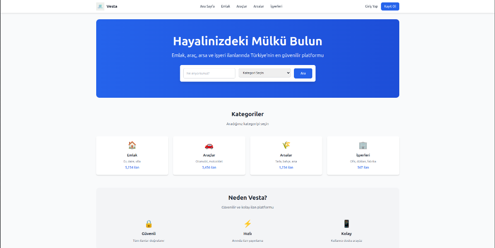
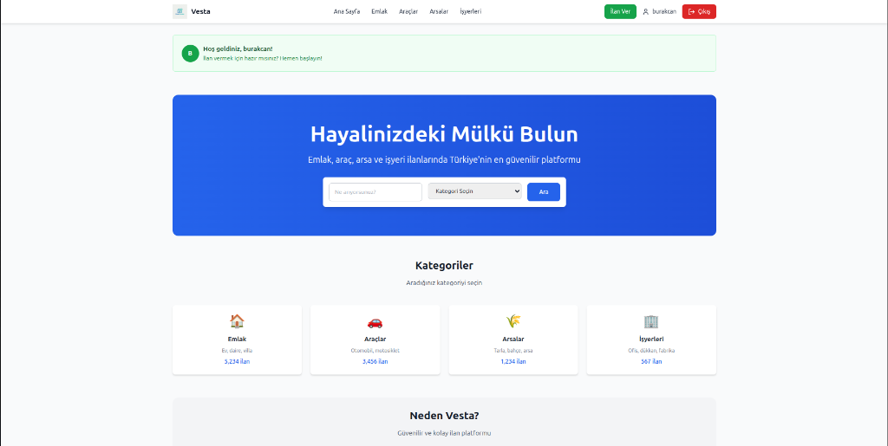
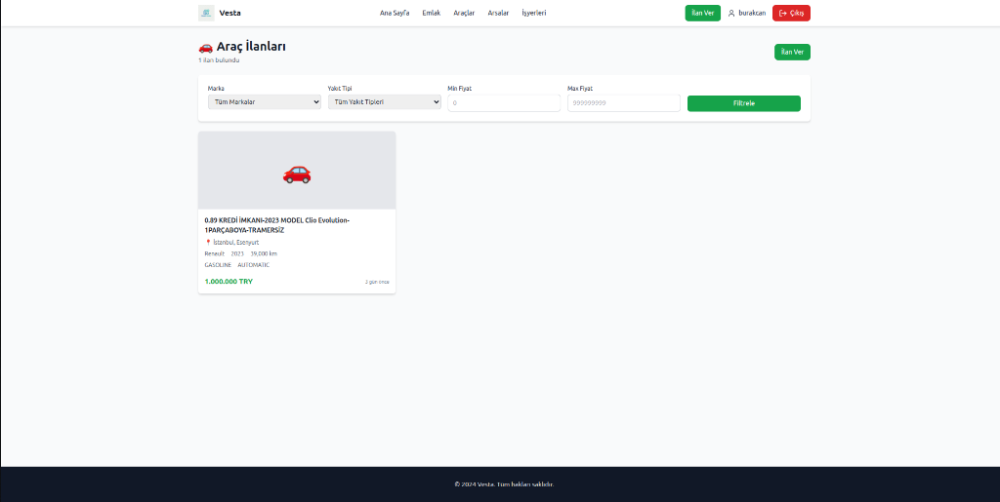

# 🏠 Vesta


**Vesta**, modern web teknolojileriyle geliştirilmiş, ölçeklenebilir; Emlak, Vasıta ve İşyeri ilanlarını tek bir çatı altında toplayan Full-Stack bir ilan platformudur.

Kullanıcı dostu arayüzü, güçlü backend mimarisi ve güvenli altyapısı ile Vesta, hem geliştiriciler için modern bir referans proje hem de kullanıcılar için pratik bir çözüm sunmayı hedefler.

## � Proje Görselleri

| Ana Sayfa | Kullanıcı Paneli |
|:---:|:---:|
|  |  |

| İlan Detay | Arama & Filtreleme |
|:---:|:---:|
|  |  |

---

## 🚀 Özellikler

*   **Çoklu Kategori Desteği:** Emlak (Konut, Arsa, İşyeri) ve Vasıta ilanları için özelleştirilmiş alanlar.
*   **Güvenli Kimlik Doğrulama:** JWT (JSON Web Token) tabanlı güvenli giriş ve kayıt sistemi.
*   **Gelişmiş Filtreleme:** Kategoriye özel dinamik filtreleme seçenekleri.
*   **Kullanıcı Paneli:** İlan yönetimi, favoriler ve profil düzenleme.
*   **Responsive Tasarım:** Mobil uyumlu, modern ve şık arayüz (Tailwind CSS).
*   **Docker Desteği:** Veritabanı (PostgreSQL) ve servisler için konteynerizasyon.

## 🛠 Teknoloji Yığını (Tech Stack)

### Backend (Java & Spring Boot)
*   **Dil:** Java 17
*   **Framework:** Spring Boot 3
*   **Veritabanı:** PostgreSQL
*   **ORM:** Spring Data JPA / Hibernate
*   **Güvenlik:** Spring Security & JWT
*   **Dokümantasyon:** OpenAPI (Swagger)

### Frontend (React & TypeScript)
*   **Framework:** React 18
*   **Dil:** TypeScript
*   **State Management:** Redux Toolkit
*   **Styling:** Tailwind CSS & Lucide Icons
*   **Form & Validation:** React Hook Form & Yup
*   **HTTP Client:** Axios

## 📦 Kurulum ve Çalıştırma

Projeyi yerel ortamınızda çalıştırmak için aşağıdaki adımları izleyebilirsiniz.

### Ön Hazırlık
*   Git
*   Docker & Docker Compose
*   Java 17 JDK
*   Node.js 18+

### 1. Repoyu Klonlayın
```bash
git clone https://github.com/burakcnaksy0/real-estate.git
cd real-estate
```

### 2. Backend (Sunucu) Kurulumu
Veritabanını Docker ile ayağa kaldırın ve uygulamayı başlatın:

```bash
cd backend/real-estate

# Veritabanını başlat
docker-compose up -d

# Uygulamayı çalıştır
./mvnw spring-boot:run
```
*Backend `http://localhost:8080` adresinde çalışacaktır.*

### 3. Frontend (Arayüz) Kurulumu
Yeni bir terminalde frontend klasörüne gidin:

```bash
cd frontend

# Bağımlılıkları yükle
npm install

# Uygulamayı başlat
npm start
```
*Uygulama `http://localhost:3000` adresinde açılacaktır.*

## 🤝 Katkıda Bulunma (Contributing)

Bu bir açık kaynak projesidir ve katkılarınıza her zaman açıktır!
1. Bu repoyu fork'layın.
2. Yeni bir feature branch oluşturun (`git checkout -b feature/harika-ozellik`).
3. Değişikliklerinizi commit'leyin (`git commit -m 'Harika özellik eklendi'`).
4. Branch'inizi push'layın (`git push origin feature/harika-ozellik`).
5. Bir Pull Request (PR) oluşturun.

## � TODO / Yol Haritası

- [ ] Unit & Integration Testlerinin artırılması
- [ ] Harita entegrasyonu (Google Maps / Leaflet)
- [ ] Çoklu dil desteği (i18n)
- [ ] CI/CD Pipeline kurulumu
- [ ] Cloudinary/S3 resim upload entegrasyonu

## 📄 Lisans

Bu proje [MIT](LICENSE) lisansı ile lisanslanmıştır.
