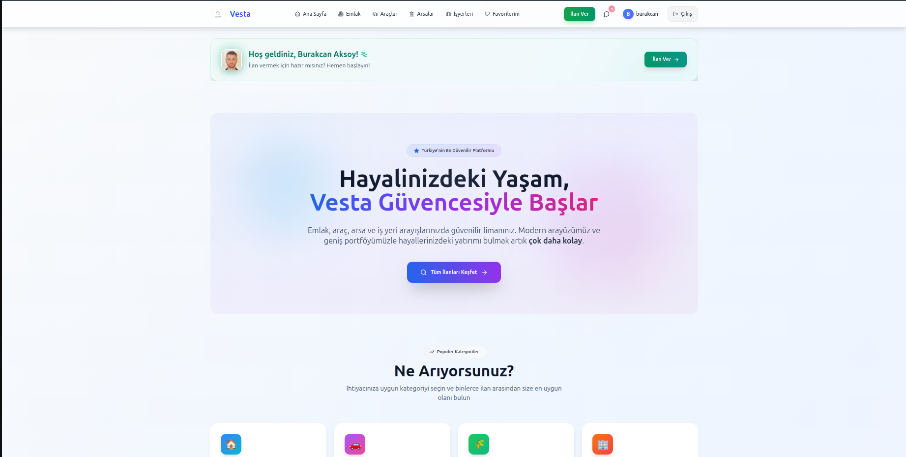
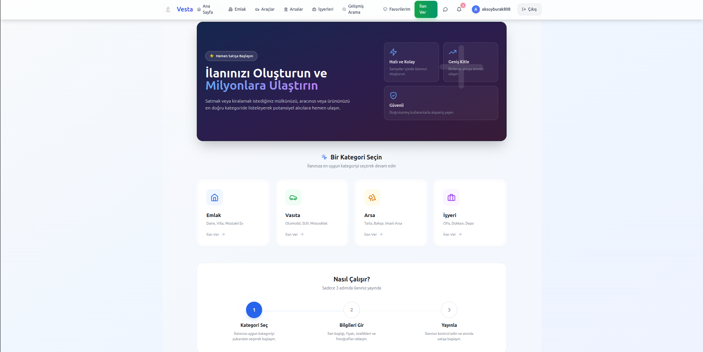
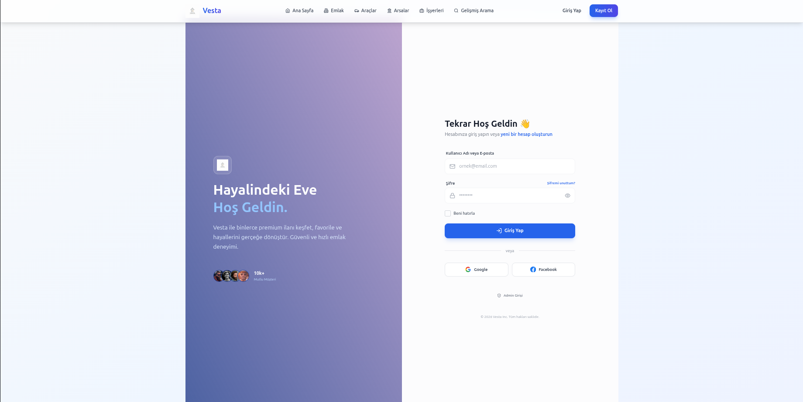
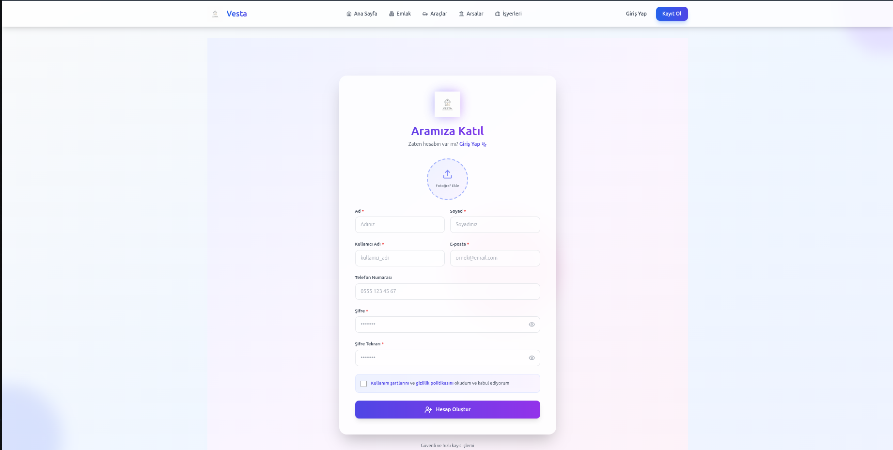
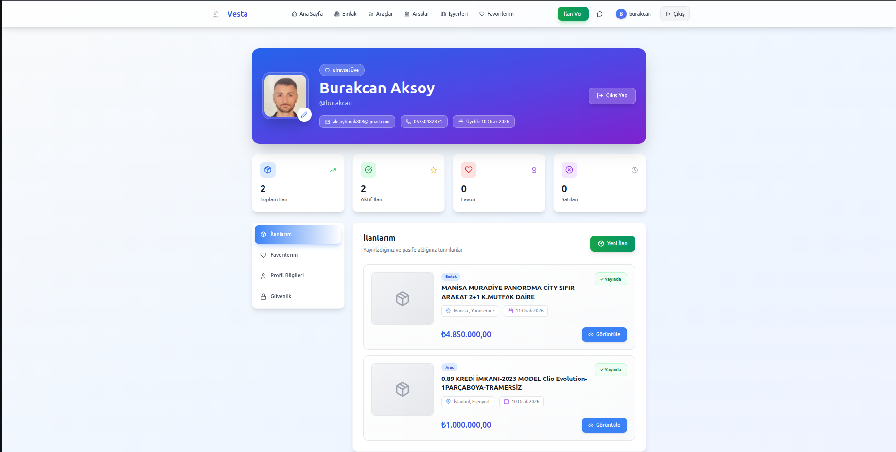
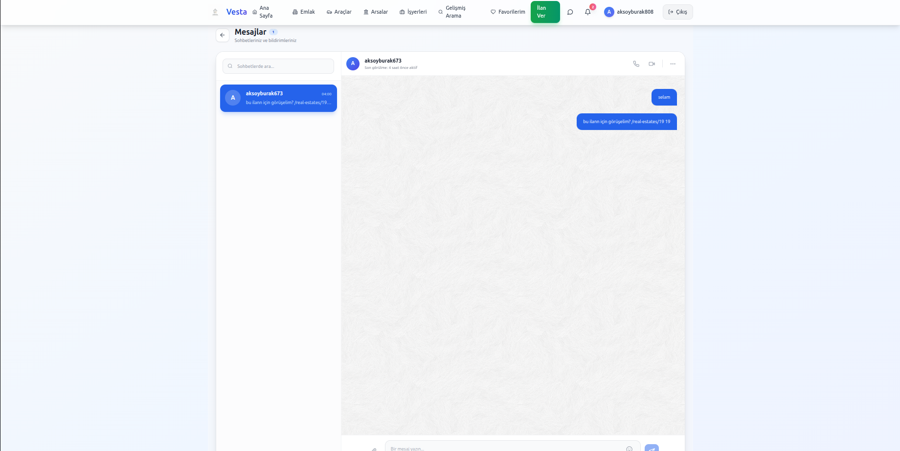
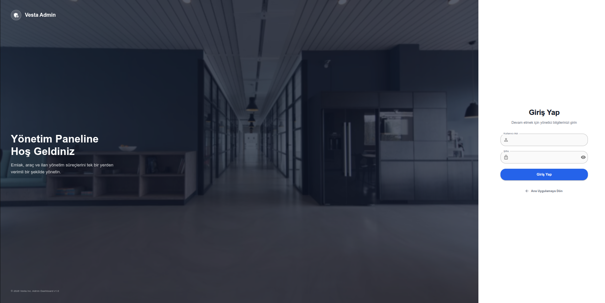

# 🏠 Vesta - Yeni Nesil İlan Platformu


**Vesta**, kullanıcıların emlak, vasıta, arsa ve işyeri gibi kategorilerde güvenle ilan verip arama yapabileceği, Full-Stack modern bir pazar yeri (marketplace) platformudur. Güçlü backend altyapısı (Spring Boot & Microservices ready) ve modern responsive frontend (React & Tailwind) mimarisi ile geliştirilmiştir.

---

## ✨ Öne Çıkan Özellikler

### 🚀 Kullanıcı Deneyimi & Arayüz
*   **Modern & Responsive Tasarım:** Tüm cihazlarda kusursuz çalışan, Tailwind CSS ile geliştirilmiş şık arayüz.
*   **İlan Verme Sihirbazı:** Adım adım kolay ilan oluşturma süreci.
*   **Gelişmiş Dashboard:** İlanlarınızı, favorilerinizi ve mesajlarınızı tek yerden yönetebileceğiniz kapsamlı kullanıcı paneli.
*   **Client-Side Optimizasyon:** Hızlı sayfa geçişleri ve anlık veri filtreleme.

### 🔍 Arama ve Keşif
*   **Akıllı Filtreleme:** Kategoriye özel (Emlak için oda sayısı, Vasıta için vites tipi vb.) detaylı filtreler.
*   **Harita Entegrasyonu:** İlan konumlarını harita üzerinde görüntüleme.
*   **Sıralama ve Sayfalama:** Binlerce ilanı performanstan ödün vermeden listeleme.

### 💬 İletişim ve Etkileşim
*   **Gerçek Zamanlı Sohbet:** WebSocket altyapısı ile anlık mesajlaşma, okundu bilgisi ve yazıyor göstergesi.
*   **Bildirim Sistemi:** Yeni mesaj, favori ilanda fiyat değişikliği gibi durumlarda anlık bildirimler.
*   **Favoriler:** Beğendiğiniz ilanları listenize ekleyin ve takip edin.

### 🛡️ Güvenlik ve Yönetim
*   **Rol Tabanlı Yetkilendirme (RBAC):** Admin, Kullanıcı ve Moderatör rolleri.
*   **Yönetici Paneli:** Kullanıcıları, ilanları ve sistem istatistiklerini yönetmek için özel admin arayüzü.
*   **Güvenli Giriş:** JWT (JSON Web Token) tabanlı kimlik doğrulama.

---

## 📸 Proje Görselleri

### 🏠 Ana Sayfa ve İlan Vitrini
Kullanıcı dostu kategori seçimi ve öne çıkan vitrin ilanları.

| Ana Sayfa | İlan Detay Sayfası |
|:---:|:---:|
|  |  |

### 🔐 Kimlik Doğrulama
Modern ve güvenli giriş/kayıt ekranları.

| Giriş Yap | Kayıt Ol |
|:---:|:---:|
|  |  |

### 👤 Kullanıcı Paneli ve İletişim
Profil yönetimi ve gerçek zamanlı mesajlaşma deneyimi.

| Profil Yönetimi | Mesajlaşma |
|:---:|:---:|
|  |  |

### 🛡️ Yönetici (Admin) Paneli
Platform yöneticileri için özel giriş ve yönetim ekranı.



### 🎥 Canlı Demo (Sohbet Özelliği)
Uygulamanın gerçek zamanlı yeteneklerini gösteren kısa bir demo.

[Videoyu İzle](assets/chat_response.mp4)

---

## 🛠 Teknoloji Yığını (Tech Stack)

### Backend (Java Ecosystem)
*   **Framework:** Spring Boot 3.3
*   **Dil:** Java 17
*   **Veritabanı:** PostgreSQL + PostGIS (Konansal veriler için)
*   **ORM:** Spring Data JPA / Hibernate
*   **Güvenlik:** Spring Security + JWT
*   **Real-time:** WebSocket (STOMP Protocol)
*   **API Docs:** Swagger UI / OpenAPI 3.0

### Frontend (React Ecosystem)
*   **Framework:** React 18
*   **Dil:** TypeScript
*   **State Management:** Redux Toolkit
*   **Styling:** Tailwind CSS
*   **Routing:** React Router v6
*   **Form:** React Hook Form
*   **Icons:** Lucide React

### DevOps & Tools
*   **Containerization:** Docker & Docker Compose
*   **Version Control:** Git & GitHub

---

## 📦 Kurulum ve Çalıştırma

Projeyi yerel ortamınızda ayağa kaldırmak için aşağıdaki adımları izleyin:

### 1. Repoyu Klonlayın
```bash
git clone https://github.com/burakcnaksy0/real-estate.git
cd real-estate
```

### 2. Backend'i Başlatın (Docker ile)
Veritabanı ve backend servislerini tek komutla başlatabilirsiniz:
```bash
cd backend/real-estate
docker-compose up -d
# Veya manuel olarak:
# ./mvnw spring-boot:run
```

### 3. Frontend'i Başlatın
```bash
cd frontend
npm install
npm start
```

Uygulama şu adreslerde çalışacaktır:
*   **Frontend:** `http://localhost:3000`
*   **Backend API:** `http://localhost:8080/api`
*   **Swagger UI:** `http://localhost:8080/swagger-ui.html`

---

## 🤝 Katkıda Bulunma

1. Forklayın (Fork)
2. Feature branch oluşturun (`git checkout -b feature/harika-ozellik`)
3. Değişikliklerinizi commit'leyin (`git commit -m 'Yeni harika özellik eklendi'`)
4. Branch'inizi push'layın (`git push origin feature/harika-ozellik`)
5. Pull Request açın
